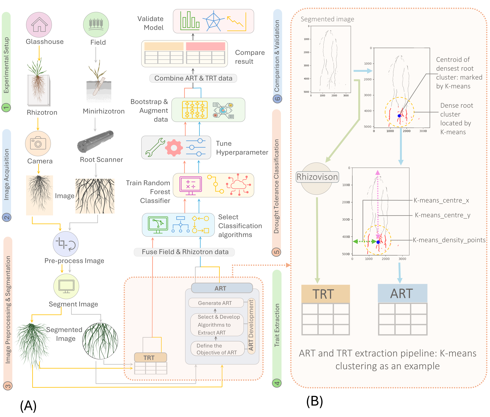

# 🌱 Seeing the Unseen, A Novel Approach to Extract Latent Plant Root Traits from Digital Images

*A novel approach to extract latent plant root traits from digital images through advanced machine learning and a custom algorithm*

## 🎯 Project Overview

ART (Algorithmic Root Trait) is designed to uncover hidden root traits using state-of-the-art computer vision and machine learning and a custom algorithm. This project implements a novel methodology that bridges conventional visually-derived traits with autonomous computational analyses, enabling the discovery of previously undetected plant root characteristics.

### Workflow Overview
<p align="center">
  
  <br>
  <em>Figure 1: Experimental setup and workflow. (A) Schematic workflow of ART and TRT extraction and drought tolerance classification: (1) Experimental setup (2) Image Acquisition: Custom glasshouse imaging setup and C-600 root imager for field (3) Image preprocessing and segmentation (4) ART and TRT extraction (5) Drought tolerance classification with the Random Forest algorithm (6) Classification result comparison and validation (B) ART and TRT extraction pipeline: TRT extraction using Rhizovision and TRT extraction using K-means Clustering Algorithm.</em>
</p>


### Core Capabilities
- Extraction of 27 algorithmic root traits using multiple unsupervised ML algorithms
- Integration with traditional root trait analysis
- Automated dense root cluster detection and spatial analysis
- Advanced statistical validation framework
- Cross-environment (glasshouse/field) compatibility


## 🔑 Keywords
`root-phenotyping` `machine-learning` `computer-vision` `plant-science` `image-analysis` `agriculture` `phenomics`  `root-traits` `drought-tolerance` `plant-breeding` `Algorithmic Root Traits (ART)`  `wheat` `latent trait` `root` `Image analysis`

## 🏗 System Architecture

```
ART/
├── scripts/
│   ├── Python/
│   │   ├── Algorithms_for_ART_Generation/
│   │   │   ├── Density_Algorithm.py         # Density-based clustering
│   │   │   ├── Density_AlgorithmPlot.py     # Visualization for density clustering
│   │   │   ├── GMM.py                       # Gaussian Mixture Models
│   │   │   ├── GMM_Plot.py                  # GMM visualization
│   │   │   ├── HDBSCAN.py                   # Hierarchical DBSCAN
│   │   │   ├── HDBSCAN_Plot.py             # HDBSCAN visualization
│   │   │   ├── K-Mean.py                    # K-means clustering
│   │   │   ├── K-Mean_Plot.py              # K-means visualization
│   │   │   ├── Mean_Shift.py               # Mean-shift clustering
│   │   │   ├── Mean_Shift_Plot.py          # Mean-shift visualization
│   │   │   ├── OPTICS.py                   # OPTICS clustering
│   │   │   ├── OPTICS_Plot.py              # OPTICS visualization
│   │   │   ├── SLIC.py                     # Superpixel segmentation
│   │   │   └── SLIC_Plot.py                # SLIC visualization
│   │   ├── Classification/
│   │   │   ├── CatBoost.py                 # CatBoost implementation
│   │   │   ├── Catboost_Validation.py      # CatBoost validation
│   │   │   ├── RandomForest.py             # Random Forest classifier
│   │   │   └── RandomForest_Validation.py   # RF validation
│   │   └── Rests/
│   │       ├── CDF_Plot.py                 # Cumulative distribution plots
│   │       ├── Classification_Algorithm_Compare.py  # Algorithm comparisons
│   │       ├── Clustering_Comparison_Plot.py # Clustering visualizations
│   │       ├── DensityPlot.py              # Density distribution plots
│   │       ├── Drought_Tolerance_Ranking.py # Drought analysis
│   │       ├── EffectSize_Comparison_Plot.py # Effect size visualization
│   │       ├── Euclidean_Distance_Matrix_Heatmap.py # Distance matrices
│   │       ├── Feature_Importance_Plot.py   # Feature analysis
│   │       ├── Heatmap_PCA_MDS.py          # Dimensionality reduction
│   │       ├── Image_Processing.py          # Image preprocessing
│   │       ├── Kruskal-Wallis.py           # Statistical testing
│   │       ├── PCA_t-SNE_original vs A_B_data.py # Data comparison
│   │       ├── Paranova.py                 # PERMANOVA analysis
│   │       ├── Performance_Comparison.py    # Performance metrics
│   │       └── Performance_Comparison2.py   # Extended performance analysis
│   ├── R/
│   │   ├── CatBoost_Validation.R           # R-based CatBoost validation
│   │   ├── RandomForest_Validation.R       # R-based RF validation
│   │   └── Rank_Plot.R                     # Ranking visualizations
├── docker/
│   ├── Dockerfile                          # Main environment config
│   ├── Dockerfile.hdbscan                  # Specialized clustering container
│   └── docker-compose.yml                  # Container orchestration
└── requirements/
    ├── requirements.txt                    # Python dependencies
    └── r_requirements.txt                  # R statistical packages
```

## 🔧 Requirements

### Hardware
- RAM: 16GB minimum, 32GB recommended
- CPU: 4+ cores recommended
- GPU: Optional, but recommended for large-scale analysis
- Storage: 20GB minimum for base installation

### Software
- Docker Desktop 24.0+
- Git
- WSL2 (for Windows users)
- CUDA drivers (optional, for GPU support)


## 🚀 Technical Stack

### Core Analysis Pipeline
- **Image Processing**: 
  - OpenCV (image preprocessing)
  - RootPainter (segmentation)
  - Custom algorithms for trait extraction
- **Machine Learning Framework**: 
  - Unsupervised Clustering:
    - DBSCAN
    - HDBSCAN
    - K-means
    - Gaussian Mixture Models
    - Mean-shift
    - OPTICS
    - Fuzzy C-means
    - SLIC
  - Classification:
    - Random Forest
    - CatBoost
    - XGBoost
    - Support Vector Machines
- **Statistical Analysis**: 
  - R tidyverse ecosystem
  - scikit-learn
  - Custom statistical validation tools

### Infrastructure
- **Containerization**: Docker 24.0+
- **Primary Environment**: Python 3.11
- **Statistical Environment**: R 4.4.2
- **Specialized Clustering**: Python 3.9 (HDBSCAN-optimized)

## 📊 Performance Metrics

| Algorithm Type | Metric | Score |
|---------------|---------|--------|
| ART Classification | Accuracy | 0.92 |
| ART Classification | ROC AUC | 0.97 |
| ART Classification | Specificity | 0.92 |
| Combined TRT+ART | Accuracy | 0.97 |
| Combined TRT+ART | ROC AUC | 0.97 |
| Combined TRT+ART | Specificity | 0.98 |

## 🛠 Installation & Setup

1. **Clone Repository**
   ```bash
   git clone https://github.com/shoaibms/ART.git
   cd ART
   ```

2. **Build Environments**
   ```bash
   docker-compose build
   ```

3. **Launch Services**
   ```bash
   docker-compose up -d
   ```

4. **Verify Installation**
   ```bash
   # Main container validation
   docker-compose exec main bash -c "python3 test_main.py"
   
   # HDBSCAN validation
   docker-compose exec hdbscan bash -c "python3 test_hdbscan.py"
   ```
## 🔧 Advanced Usage

### Custom Algorithm Integration
```bash
# Add new algorithm to ART pipeline
python scripts/Python/Algorithms_for_ART_Generation/custom_algorithm.py


## 🔬 Validation Framework

The system implements a comprehensive validation framework:
- 10-fold cross-validation
- Independent validation sets for glasshouse and field data
- Bootstrapped augmentation for improved generalization
- Multiple performance metrics (accuracy, precision, ROC AUC)
- Environment-specific validation protocols

## 📈 Data Processing Pipeline

2. Enhance the Data Processing Pipeline with more detail:

```markdown
## 📈 Data Processing Pipeline

1. **Image Acquisition**
   - Glasshouse rhizotron imaging (Sony a7R camera, 35mm F1.4 GM lens)
   - Field minirhizotron scanning (In-Situ Root Imager ICI-600)
   - QR code tracking system for sample identification
   - Image resolution: 3410 × 5075 pixels (rhizotron)

2. **Preprocessing**
   - Automated orientation correction to portrait
   - Region of interest extraction
   - Resolution standardization
   - Background removal
   - RootPainter segmentation (Dice score approaching 1)

3. **Trait Extraction**
   - Traditional trait calculation (23 TRTs via RhizoVision)
   - Algorithmic trait computation (27 ARTs via 9 algorithms)
   - Spatial coordinate analysis (density points, center coordinates)
   - Quality control and validation

4. **Analysis**
   - Statistical validation (PERMANOVA, Cliff's Delta)
   - Performance evaluation (ROC AUC, precision, recall)
   - Cross-environment testing
   - Feature importance ranking

## 🌟 Related Projects

- [RootPainter](https://github.com/Abe404/root_painter)
- [PlantCV](https://github.com/danforthcenter/plantcv)
- [RhizoVision Explorer](https://github.com/rootphenomics/RhizoVisionExplorer)


🔎 FAQ
<details>
<summary>What image formats are supported?</summary>
ART supports common image formats including JPEG, PNG, and TIFF.
</details>
<details>
<summary>Can I use ART without Docker?</summary>
Yes, but Docker is recommended for consistent environments.
</details>
<details>
<summary>Is GPU support required?</summary>
No, but GPU acceleration can significantly improve processing speed.
</details>


## 🤝 Contributing

1. Fork the repository
2. Create a feature branch
3. Implement changes with tests
4. Submit a pull request

See [CONTRIBUTING.md](CONTRIBUTING.md) for detailed guidelines.

## 📚 Citation

If you use ART in your research, please cite:

```
yet to come
```

## 🙏 Acknowledgments
- Docker community
- ML framework developers
- [Adam Dimech](https://github.com/AdamDimech)

## 📜 License

This project is licensed under the MIT License - see [LICENSE](LICENSE) for details.

---
*Developed at Agriculture Victoria and La Trobe University for advanced plant phenotyping research*