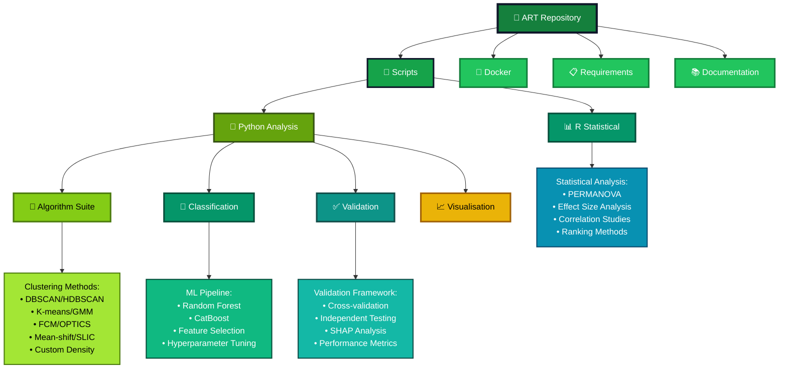
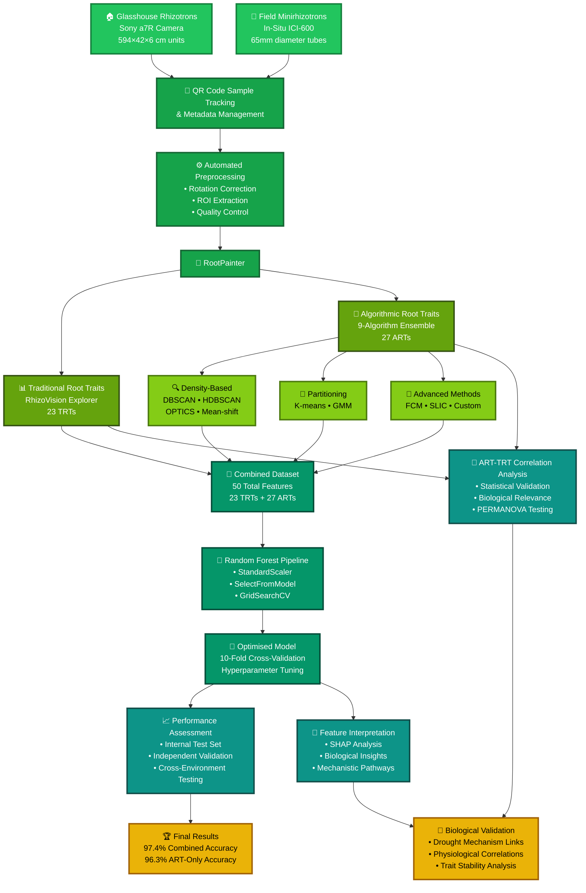

# 🌱 Seeing the Unseen: A Novel Approach to Extract Latent Plant Root Traits from Digital Images

*Revolutionising plant phenotyping by using ensemble machine learning to uncover hidden root architectural patterns for drought tolerance classification.*

[](https://github.com/shoaibms/ART)
[](https://www.python.org/)
[](https://www.r-project.org/)
[](https://www.docker.com/)
[](LICENSE)
[](https://doi.org/10.1016/j.plaphe.2025.100088)

## 🎯 The Challenge & Our Solution

**The Problem**: Traditional root analysis relies on predefined geometric traits visible to the human eye. While valuable, these methods may miss subtle or complex spatial patterns within root systems—patterns that could be critical for understanding plant adaptation and resilience.

**Our Innovation**: The **Algorithmic Root Trait (ART)** extraction method represents a paradigm shift in plant phenotyping. By employing an ensemble of nine algorithms (eight established unsupervised machine learning methods plus a custom algorithm), ART autonomously discovers and quantifies latent spatial patterns, specifically the characteristics of dense root clusters that are invisible to traditional analysis.

**The Breakthrough**: ART-based models achieve **96.3% accuracy** in classifying drought tolerance in wheat, dramatically outperforming traditional methods (85.6%). When combined, ARTs and traditional traits reach a remarkable **97.4% accuracy**, with just **4 selected ARTs** delivering the same predictive power as all **23 traditional traits**—representing a **5.8× increase in information density**.

<p align="center">
  
  <br>
  <em><strong>Figure 1:</strong> Comprehensive ART workflow from experimental setup to validation. The pipeline integrates multi-environment image acquisition, automated preprocessing, parallel ART and TRT extraction, and robust machine learning classification.</em>
</p>

## 🏆 Performance Highlights

The evidence is compelling: ART consistently outperforms traditional approaches across all metrics.

| Model Configuration        | Features Used   | Accuracy  | Precision | ROC AUC | F1 Score |
| -------------------------- | --------------- | --------- | --------- | ------- | -------- |
| **Traditional Traits Only**| 23 TRTs         | 85.6%     | 86.0%     | 0.927   | 0.854    |
| **Algorithmic Traits Only**| 27 ARTs         | **96.3%** | **96.3%** | **0.997** | **0.963**  |
| **Combined (ART + TRT)**   | 50 Total Traits | **97.4%** | **98.8%** | **0.998** | **0.973**  |
| **Optimal Subset**         | 4 Selected ARTs | 85.1%     | 85.9%     | 0.923   | 0.848    |

### Key Performance Insights

> **🎯 Independent Validation**: The combined model achieved **91.3% accuracy** and **0.962 ROC AUC** on completely unseen data, proving robust generalisation.

> **📊 Feature Importance**: ARTs contribute **73.3% of predictive power** in combined models, despite representing only 54% of features.

> **🔬 Trait Stability**: ARTs demonstrate significantly superior stability across environments (CV = 0.762 vs 1.361 for TRTs, p = 0.0137).

> **⚡ Information Density**: Just 4 ARTs match the performance of all 23 traditional traits—a **5.8× efficiency gain**.

## 🚀 Key Innovations & Capabilities

-   **🔍 Discover Hidden Patterns**: Extracts 27 novel ARTs that capture algorithmically-defined root clusters, revealing information invisible to standard analysis
-   **🎯 Achieve Superior Performance**: Drastically improves classification accuracy through mechanistic drought adaptation insights
-   **⚡ Boost Phenotyping Efficiency**: Delivers unprecedented information density for high-throughput screening programmes
-   **🧬 Gain Biological Insight**: Connects algorithmic traits to established drought adaptation mechanisms via SHAP analysis
-   **🌍 Ensure Cross-Environment Robustness**: Proven effective across controlled glasshouse and variable field conditions
-   **🔧 Provide Complete Framework**: Offers fully reproducible pipeline from image acquisition to biological interpretation

## 🏗️ Repository Architecture



## 🏗️ Technical Architecture & Workflow

ART employs a sophisticated multi-stage pipeline designed for scientific rigour and reproducibility, processing data from image acquisition through biological interpretation.

### 📋 Pipeline Overview



### 🔧 The ART Algorithm Ensemble

| Algorithm Category | Methods | Key Strengths | Cluster Characteristics |
|-------------------|---------|---------------|------------------------|
| **Density-Based** | DBSCAN, HDBSCAN, OPTICS, Mean-shift | Handles irregular shapes, noise-robust | Elongated, variable density |
| **Partitioning** | K-means, Gaussian Mixture Models | Efficient, well-understood | Globular, spherical clusters |
| **Advanced Methods** | Fuzzy C-means, SLIC Superpixels | Soft clustering, spatial continuity | Adaptable shapes, fuzzy boundaries |
| **Custom Algorithm** | KDE + K-means refinement | Tailored for root architecture | Density-weighted, biologically informed |

## 🔬 Rigorous Scientific Validation

Our claims are supported by a comprehensive validation framework ensuring statistical and biological robustness.

### 🧪 Physiological Ground-Truthing
Confirmed drought tolerance status using established metrics:
- **Leaf Relative Water Content (RWC)**
- **Stomatal conductance measurements** 
- **Tiller number analysis**
- **Effect size quantification** (Cliff's Delta)

### 📊 Statistical Verification
- **PERMANOVA**: Confirmed ARTs and TRTs capture statistically distinct architecture aspects (p = 0.002)
- **Cross-Validation Stability**: Excellent model stability during tuning (CV < 2.6% across metrics)
- **Independent Testing**: Final model validated on completely unseen data

### 🔗 Biological Interpretation
- **Strong Correlations**: 66/129 significant ART-TRT correlations exceeded |r| = 0.7
- **Mechanistic Links**: Top ARTs (FCM_centre_x, HDBSCAN_density_points) connected to drought adaptation pathways
- **Functional Validation**: ARTs quantify spatial positioning, biomass allocation, and architectural trade-offs

## 🛠️ Installation & Quick Start

### Prerequisites
- **RAM**: 16GB minimum (32GB recommended)
- **CPU**: 4+ cores recommended
- **Storage**: 20GB available space
- **OS**: Linux, macOS, Windows (Docker compatible)

### 1. Repository Setup
```bash
# Clone the repository
git clone https://github.com/shoaibms/ART.git
cd ART
```

### 2. Docker Deployment (Recommended)
```bash
# Build and launch all services
docker-compose up --build -d

# Verify installation
docker-compose exec main python -c "print('ART environment ready!')"
```

### 3. Native Installation (Advanced)
```bash
# Create Python environment
conda create -n art_env python=3.10.2
conda activate art_env

# Install dependencies
pip install -r requirements/requirements.txt
Rscript scripts/R/install_r_packages.R

# Test installation
python scripts/test_installation.py
```


## 🔑 Keywords
`algorithmic-root-traits` `machine-learning` `plant-phenotyping` `drought-tolerance` `wheat-breeding` `computer-vision` `ensemble-methods` `root-architecture` `high-throughput-phenotyping` `agricultural-ai` `crop-resilience` `unsupervised-learning` `spatial-analysis` `precision-agriculture`

## 🌟 Related Scientific Tools

### Core Dependencies
- **[RootPainter](https://github.com/Abe404/root_painter)**: Deep learning semantic segmentation
- **[RhizoVision Explorer](https://github.com/rootphenomics/RhizoVisionExplorer)**: Traditional trait extraction
- **[PlantCV](https://github.com/danforthcenter/plantcv)**: Comprehensive plant image analysis


## 🙏 Acknowledgements

### Funding & Support
This research was supported by **Agriculture Victoria**, Department of Energy, Environment and Climate Action, Australia, with additional institutional support from **La Trobe University** School of Applied Systems Biology.

## 📜 Licence & Usage

This project is licensed under the **MIT Licence** - see [`LICENSE`](LICENSE) for details.


---

<div align="center">

**🌾 Advancing Plant Science Through Computational Innovation 🌾**

*A collaboration between Agriculture Victoria & La Trobe University*

[](https://agriculture.vic.gov.au/)
[](https://www.latrobe.edu.au/)

*Empowering the future of sustainable agriculture through algorithmic discovery*

</div>
